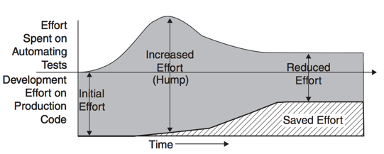
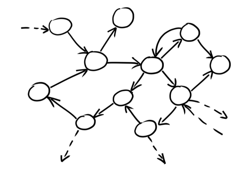
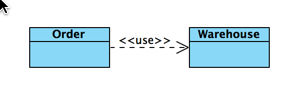
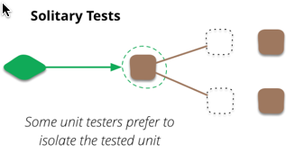
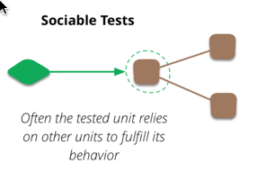
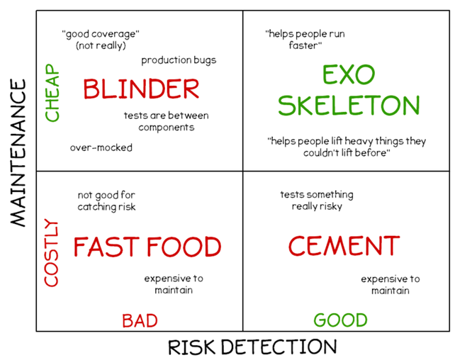

#如何更好地做单元测试

> 在做单元测试的过程中，必需面临的一个选择是遵循`classical style`还是`mockist style`。
> 试图回答这个问题无异于公开声明`豆浆是甜的`，`PHP是最好的语言`。晒三观的结果很可能是被归为异类。理论派们可以摇旗呐喊、辩论不休，让战火延绵不绝，而作为程序员的我们，却迫切需要一种原则来指导我们却在日常的工作中做出正确的选择。
> 两种方法争论良久而无定论，很可能的情况是这两种方法旗鼓相当，一种方法并没有压倒另一种方法的绝对优势。
> 本文将着重分析`classical style`与`mockist style`各自的优势及弊端，以便于在编写单元测试的过程做出理性的权衡。

##单元测试经济学
>  I get paid for code that works, not for tests, so my philosophy is to test as little as possible to reach a given level of confidence. 
> <p align="right">—— Kent Beck</p>

单元测试可以从以下方面降低软件的开发维护成本：
* 单元测试，尤其是按TDD的方式开发的单元测试，驱动了良好的设计，有助于编写出低耦合、易测试的代码，提升了软件的内部质量
* 单元测试降低了新feature的开发成本
	* 及时反馈，及早发现实现中可能的bug，降低错误修正的成本
* 单元测试降低了系统的维护成本
	* 单元测试有助于我们理解被测系统(`SUT`)，单元测试作为`SUT`的客户，从客户的角度描述了`SUT`的职责和交互方式
	* 作为自动化的回归测试是重构和新`feature`开发的安全网，以确保在代码变更的过程中没有破坏原有的功能
	* 关注点单一的单元测试，能帮助我们尽快地定位问题

综上所述，单元测试从提升内部质量、及时验证系统的正确性、帮助快速发现并定位问题三个方面降低了软件的开发成本。

单元测试本身不产生可交付的价值，如果想要让单元测试产生正向的ROI，单元测试所带来的产品代码开发、维护的成本降低，必须高于单元测试本身所带来的开发、维护成本。


##两种风格的单元测试


在面向对象的世界里，角色（`role`）及其角色（`role`）之间的协作（`collaboration`）成了整个软件系统。上图中每个圆圈代表一个`role`，圆圈之间的箭头则代表了`role`之间的协作。这个网络构成了软件系统的模型，每一个`role`可以有不同的实现，而一个类也可以实现一个或几个不同的`role`。
在面向对象的世界里行为为王，相对于具体的实现，对象之间的协作即`API`往往更稳定。要验证某个类实现的正确性，就需要验证它跟协作对象之间的交互是否符合预期。
下文以`Order`类为例讨论两种不同的单元测试的风格。

```cpp
struct Warehouse;
struct Order {
    Order(const std::string & name, unsigned int count)
        : _item_name(name)
        , _item_count(count) {
    }
    Status fill(Warehouse & warehouse);
    //code omitted for brevity
private:
    std::string _item_name;
    unsigned int _item_count;
};

struct Warehouse {
    virtual void add(const std::string & product, unsigned int count) = 0;
    virtual Status remove(const std::string & product, unsigned int count) = 0;
    virtual unsigned int get_inventory(const std::string & product) const = 0;
    virtual ~Warehouse() {}
};
```








##参考资料
[UnitTest](http://martinfowler.com/bliki/UnitTest.html)

[Mocks Aren't Stubs](http://martinfowler.com/articles/mocksArentStubs.html)

[Working Effectively with Unit Tests](https://www.amazon.com/Working-Effectively-Unit-Tests-Fields-ebook/dp/B00QS2HXUO)

[xUnit Test Patterns: Refactoring Test Code](https://book.douban.com/subject/1859393/)

[Growing Object-Oriented Software, Guided by Tests](https://book.douban.com/subject/4156589/)

[Test Automation Without A Headache Five Key Patterns](https://vimeo.com/144866523)
